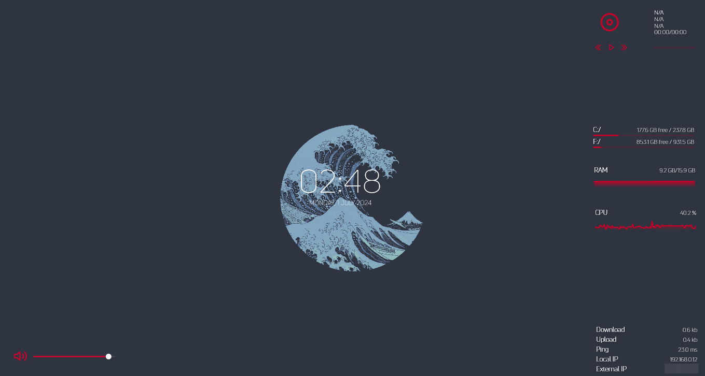

# Personal Rainmeter Skins / SysDash

SysDash is a Rainmeter skin that displays system information in a clean and simple way. It is not owned by me, I have simply collected it here for my own use. If you are the owner of this skin and would like me to remove it, please let me know.

## Screenshots

## Configuration

SysDash is highly configurable. You can change the colors, fonts, and more.

I have included my own configuration in this repository. You can find it [here](./variables.ini).

## Installation

1. Download and install Rainmeter from [here](https://www.rainmeter.net/).
2. Download the SysDash skin from [here](./skin.rmskin).
3. Install the skin by double-clicking the downloaded file.
4. Load the skin in Rainmeter.
5. To use my configuration, replace the `variables.ini` file in the `@Resources` folder with the one provided in this repository.