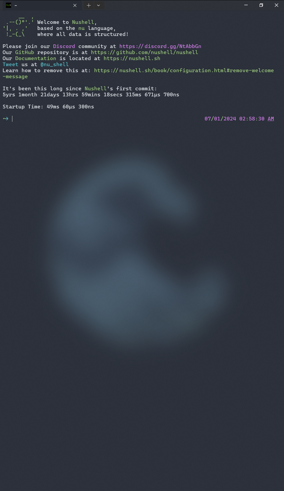
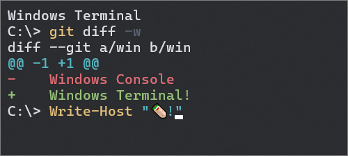

# Personal Machine / Windows Terminal

This is a collection of configurations and themes that I use to customize Windows Terminal.

## Overview

### Color Scheme

## Installation

1. Download and install Windows Terminal from the [Microsoft Store](https://www.microsoft.com/en-us/p/windows-terminal/9n0dx20hk701).
2. Open Windows Terminal and press `Ctrl+,` to open the settings.
3. Replace the contents of the `settings.json` file with the contents of the `settings.json` file in this repository.
4. Save the file and restart Windows Terminal.